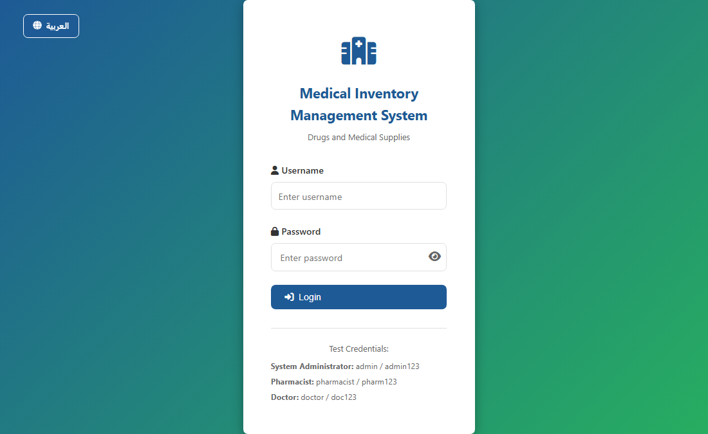

# Medical Supplies Inventory Management System

## Project Description
This is a comprehensive web-based system designed to manage the inventory of medical supplies and pharmaceuticals. It provides an efficient solution for tracking stock levels, managing suppliers, handling user requests, and generating critical reports. The system is built using **PHP** for the backend, **MySQL** for the database, and standard **HTML/CSS/JavaScript** for the frontend.

The project is hosted under the repository name `medical-supplies-management`.

## Key Features
The system offers a robust set of features to streamline inventory operations:

*   **Secure User Authentication:** Separate login for different user roles (e.g., Admin, Staff).
*   **Inventory Tracking:** Real-time monitoring of stock levels, including item details, quantity, and expiry dates.
*   **Supplier Management:** Dedicated module to manage supplier information.
*   **Request Handling:** System for managing and tracking requests for medical supplies.
*   **Reporting:** Generation of essential reports, including PDF exports, for inventory status and expiry warnings.
*   **Multi-language Support:** Built-in support for Arabic and English languages.

## Technology Stack
| Component | Technology | Description |
| :--- | :--- | :--- |
| **Backend** | PHP | Core logic and API handling. |
| **Database** | MySQL | Used for data storage and management. |
| **Frontend** | HTML, CSS, JavaScript | User interface and client-side interactivity. |
| **PDF Generation** | FPDF Library | Used for generating PDF reports. |

## Installation and Setup

### Prerequisites
You need a running web server environment with PHP and MySQL support, such as XAMPP, WAMP, or a dedicated LAMP/LEMP stack.

1.  **Clone the Repository:**
    ```bash
    git clone [YOUR_REPOSITORY_URL] medical-supplies-management
    ```
2.  **Database Setup:**
    *   Create a new MySQL database named `medical_inventory_db`.
    *   Import the provided SQL script to set up the necessary tables and initial data:
        ```bash
        # Path to the SQL script
        /home/ubuntu/medical-supplies-management/database/medical_inventory_db.sql
        ```
3.  **Configuration:**
    *   Open `config.php` and update the database connection details if they differ from the defaults (`DB_HOST`, `DB_USER`, `DB_PASS`).
4.  **Access the System:**
    *   Place the project folder in your web server's root directory (e.g., `htdocs` for XAMPP).
    *   Access the system via your browser: `http://localhost/medical-supplies-management/`

## Project Screenshots

### Login Page
A secure login interface to authenticate users based on their roles.


### Dashboard Overview
The main dashboard providing a quick overview of inventory status, notifications, and key metrics.



## Developer
**Akil Alsufi**
*   https://github.com/Eng-Akil-Alsufi

## License
This project is licensed under the **MIT License** - see the [LICENSE](LICENSE) file for details.
